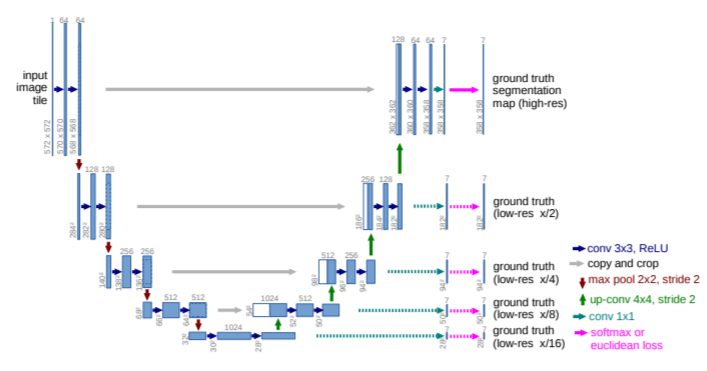
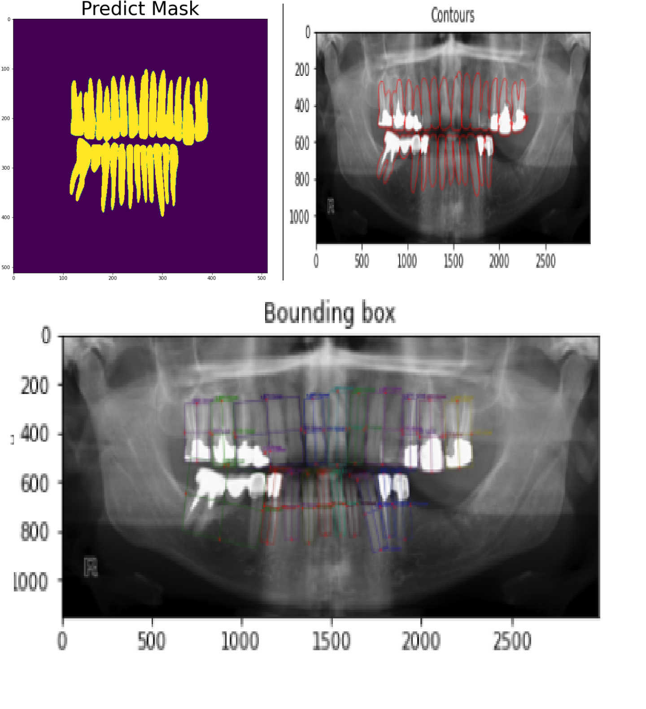

### Example : U-Net to perform dental image segmentation

This implementation is vastly inspired from this [link](https://github.com/SerdarHelli/Segmentation-of-Teeth-in-Panoramic-X-ray-Image-Using-U-Net) and is trying to provide an example for this [paper](http://www-o.ntust.edu.tw/~cweiwang/ISBI2015/challenge2/isbi2015_Ronneberger.pdf). However, I wanted to provide a model working with images representing the whole mouth instead of a few teeth. This would actually be a step-up from what is shows in the paper. However, in this case, we do not focus on the different parts of the tooth, simply whether or not the pixel is a tooth.

#### Dependencies

```bash
pip install -r requirements.txt
```

#### The project

This project trains this network. However, we are only interested in the high-resolution segmentation so this will be the only part where we will keep the pink arrow section.



This network is already implemented in the github aforementionned. 

To obtain results, simply follow the notebook *Unet example for image segmentation.ipynb*. You can train your own network or can simply load a pre-trained model as indicated in it. 

#### Results

The output of the network will be the binary mask, and two functions are here to visualize the boundaries of the different teeth and to identify a box around it.



#### Conclusion

This clearly shows the ability of such network to perform image segmentation and contouring. Furthermore, it should be possible to add a function to find the global position of each tooth in order to label it to its correct number (that is unique per tooth).